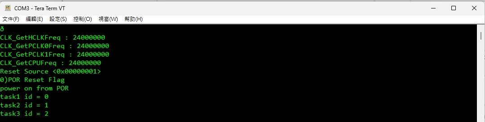
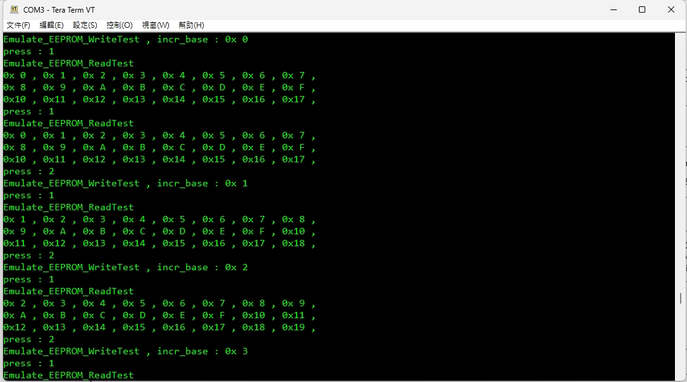

# M2003 BSP Flash Emulate EEPROM

EEPROM emulation example for Nuvoton M2003 series MCU.

This project uses APROM flash to emulate EEPROM data storage.
The current sample is configured for a 32 KB flash device and reserves the last 4 pages for EEPROM emulation.

## Project Summary

- MCU family: M2003 series
- Flash size: 32 KB APROM
- Flash page size: 512 bytes
- EEPROM emulate pages: 4 pages
- EEPROM emulate start address: `0x7800`
- User data amount: 24 bytes
- UART baud rate: 115200

## EEPROM Configuration

Current EEPROM emulation settings are defined in [SampleCode/Template/EEPROM_Emulate.h](SampleCode/Template/EEPROM_Emulate.h):

```c
#define DATA_FLASH_OFFSET   (0x7800UL)
#define DATA_FLASH_AMOUNT   (24)
#define DATA_FLASH_PAGE     (4)
```

Address calculation:

- APROM end address: `0x8000`
- Reserved EEPROM area size: `4 x 512 = 0x800`
- EEPROM emulate start address: `0x8000 - 0x800 = 0x7800`

Reserved flash range:

- `0x7800 ~ 0x79FF`
- `0x7A00 ~ 0x7BFF`
- `0x7C00 ~ 0x7DFF`
- `0x7E00 ~ 0x7FFF`

## Sample Code

Main sample is located at:

- [SampleCode/Template/main.c](SampleCode/Template/main.c)
- [SampleCode/Template/EEPROM_Emulate.c](SampleCode/Template/EEPROM_Emulate.c)
- [SampleCode/Template/EEPROM_Emulate.h](SampleCode/Template/EEPROM_Emulate.h)

UART test command mapping:

- Press `1`: Read EEPROM emulate data
- Press `2`: Write incremental test pattern
- Press `3`: Erase data by writing `0xFF`
- Press `x` / `z`: Chip reset

## Test Result

Test has been completed on the current workspace version.

Observed behavior:

- Power-on log is printed correctly.
- EEPROM initialization completes successfully.
- Repeated write and read operations return expected incremental data.
- Data remains readable across repeated command tests.

### Power On Log



### Read / Write Log



## Folder Structure

- `Library`
  BSP library, CMSIS, device headers, and standard drivers.
- `SampleCode`
  Application sample code.
- `log_power_on.jpg`
  Power-on UART log screenshot.
- `log_KEY1_KEY2.jpg`
  UART read/write verification screenshot.

## Build Environment

- IDE project: `SampleCode/Template/Keil`
- Serial terminal used in log capture: Tera Term VT

## Notes

- This project reserves the last 4 APROM pages for EEPROM emulation, so application code must not use flash space from `0x7800` to `0x7FFF`.
- If the flash size or page size changes, `DATA_FLASH_OFFSET` and related EEPROM settings must be updated together.
